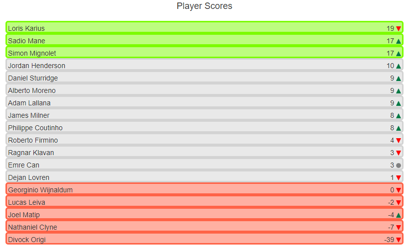
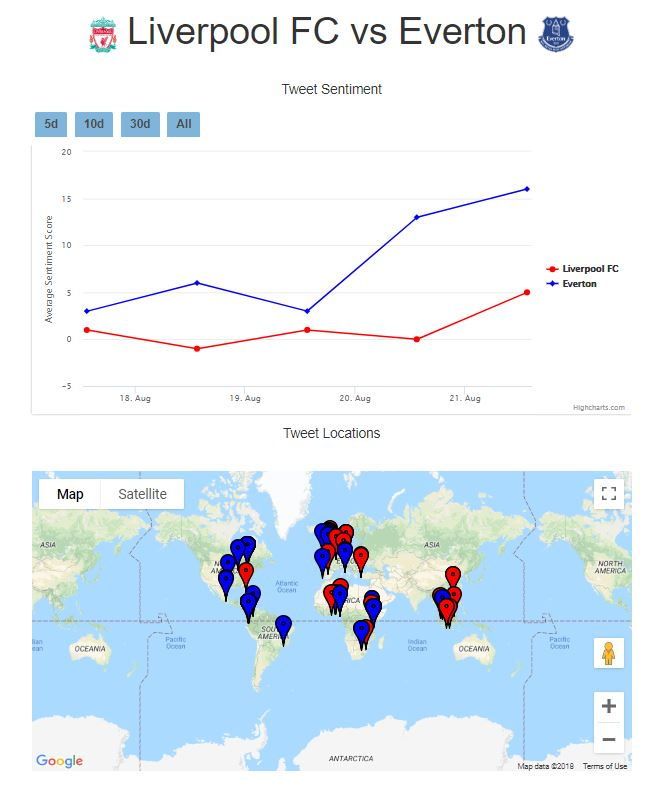

# SoccerSentimeter
Website which tracks and analyzes Twitter sentiment of Premier League teams and players. Written in the Django framework. Uses the Twitter, Google Maps, Highcharts, MediaWiki, and TextBlob APIs. 

## Overview

For each team, its sentiment score history is displayed in a line graph. These scores are determined by averaging the sentiment score of a sample of up to 1000 tweets containing the team's name over the past day. Currently, the database contains only data for Premier League teams.

Locations of tweets about a particular team are displayed via twitter geolocation data. Note that this data only exists for a small fraction of tweets.

Player scores are determined the same way as those of teams. A green arrow means a positive change from the previous day, a red arrow means a negative change, and a gray circle means the score was unchanged or no tweets were found. Note that small sample size may skew some player scores. Hovering over each player gives a small sample of text from Wikipedia describing the player. Recently transferred players may not appear in the database.

Teams can also be compared on team sentiment, tweet location, and player sentiment (not shown). 

## Tech Stack

Several scripts (initdb.py, updatedb.py, maketransfers.py) initialize and update the SQLLite database of player and team data. These scripts call the twitter API and use the textblob library to perform sentiment analysis.

Django is used for the web app. The front end calls Highcharts, Google Maps, and MediaWiki APIs to display team and player information.